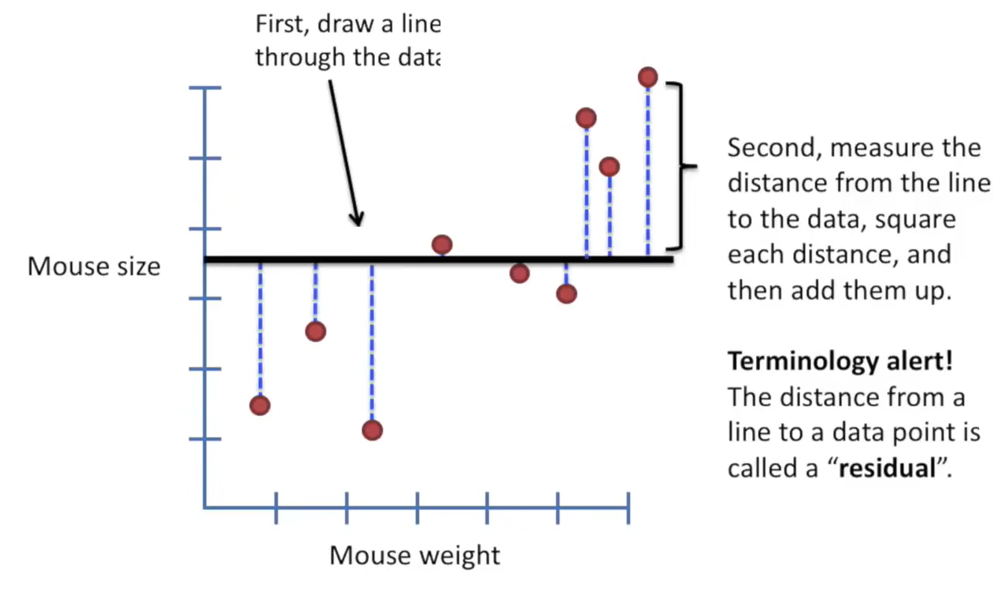
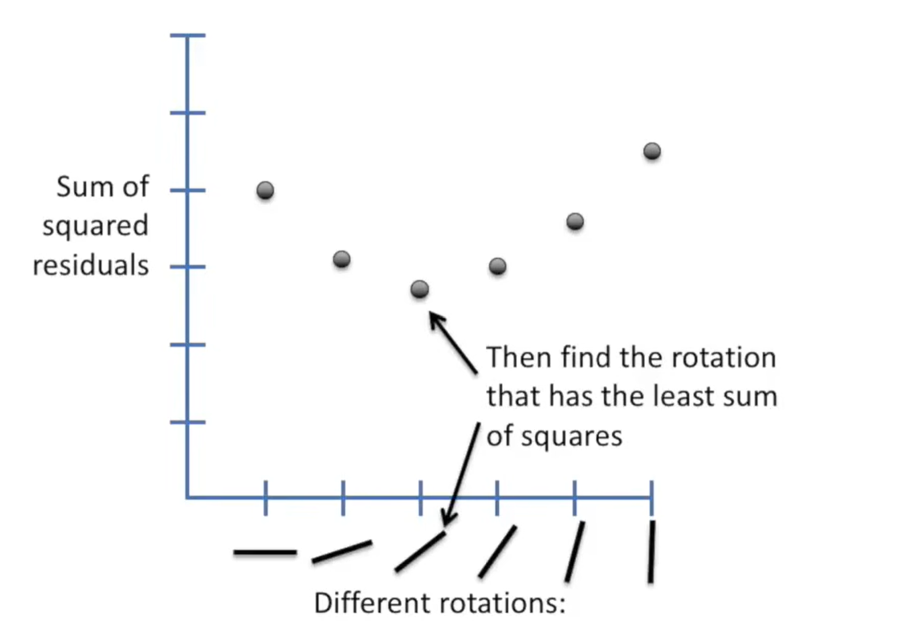
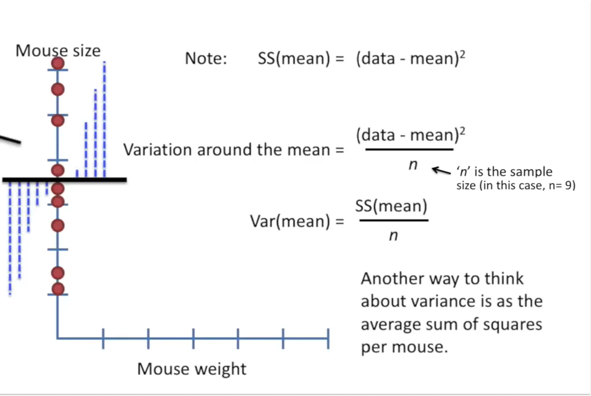

# Linear Regression

Category: Classic Machine Learning
Status: Needs Review
Sub Category: Supervised

# **Linear** Regression

مثال:  ما یه داده داریم برای وزن و سایز موش

هدف اینه که ما بتونیم یه فرمول ریاضی ای پیدا کنیم که اگر وزن موش جدیدی رو داشتیم بتونیم سابزشو حدس بزنیم!
برای اینکه بتونیم این کارو بکنیم باید اول ببینیم این داده ای که داریم چه رابطه ای دارن و اصلا وزن موش با سایزش همبستگی داره

معمولا اول میان یه رابطه ی خطی رو در نظر میگیرن ($y = ax + b$) بعد میگن خب ما باید الان اینا a و b رو پیدا  کنیم چجوری؟

1. میایم اول یه خط میکشیم 
2. بعد میایم فاصله ی خط با نقطه رو حساب میکنیم (بهش میگن residual یعنی باقیمانده) به توان دو میرسونیم و بعد کلشو جمع میکنیم
3. بعد میایم یه ذره میچرخونیم این خط رو با هدف اینکه این sum of squared residuals یا همون  ss(fit) (چون فیت کردیم به خط) رو کم کنیم.
4. بعد همین طور ادامه میدیم تا اینکه ببنیم کجا این ss کمینه میشه! 
5. میشه خط ما که یه عرض از مبدا داره یه شیب و

 

**چون شیب 0 نیست نشون میده که داشتن وزن موش به حدس زدن سایز موش  کمک میکنه. اما سوال پیش میاد که چه قدر این حدس نزدیک به واقعیته؟**

برای اینکه اینو بفهمن میان $r^2$ رو حساب میکنن

## $R^2$  ( R-squared)

الان سایز موش متغیر هدفه! ما میایم میانگینشو میگیریم و بعد حساب میکنیم sum of squared residuals یا همین ss(mean) بعد میایم واریانشم حساب میکنیم (واریانس یعنی به طور میانگین چه قدر داده ها از میانگین فاصله دارن)

همین کارو برای خط هم کرده بودیم و واریانسم حساب میکنیم!

$$
R^2 = \frac{SS(mean) - SS(fit)} {SS(mean)} = 1- \frac{SS(fit)} {SS(mean)} 
$$

یعنی داره میگه ما اگر چه قدر از تفاوت بین سایز موشها (واریانس) (تفاوت بین سایز موش ها) به خاطر وزنشونه!

how much of the variation in mouse size can be explained by taking mouse weight into account!

.png)

مثلا توی این مثال میشه گفت که 60 درصد سایز موش به وزنش بستگی داره! 

مثال های 1 و 0 

.png)

## adding more predictors

اگر علاوه بر وزن اندازه دم هم داشته باشیم و بذاریم توی معادله میاد به جای خط همین کارا رو با صفحه میکنه و بعد ما یه فرمول صفحه خواهیم داشت. 

حالا اگر که اضافه کردن این متغیر جدید به ما کمک اصلا نکنه (یعنی واقعا هیچ ارتباطی وجود نداشته باشه)، شیب = صفر میشه. یعنی اضافه کردن هیچ وقت باعث بدتر شدن مدل نمیشه!!!! اماااااا

اگر حتی به طور تصادفی یه اثری داشته باشه اون وقت ما یه فرمول اشتباه ممکنه داشته باشیم!  پس تکلیف چیه؟

adjusted $R^2$ → in essence, scales $R^2$ by the number of parametere

# F score!

اگر فقط **دو نقطه** داشته باشیم، معمولاً ممکن است وسوسه شویم یک خط از بینشان رد کنیم و بعد درباره‌ی **p-value** حرف بزنیم. اما اینجا باید دقت کنیم که p-value را معمولاً از روی **آماره‌ی F** حساب می‌کنند. پس اول باید ببینیم خود **F** چیست.

ایده‌ی کلی **F** این است که بررسی کند آیا مدلی که ساخته‌ایم، واقعاً نسبت به یک مدل ساده‌تر چیز بیشتری توضیح می‌دهد یا نه.

مثلاً در رگرسیون خطی ساده، داریم دو مدل را با هم مقایسه می‌کنیم:

- **مدل ساده‌تر**: فقط میانگین را در نظر می‌گیرد
- **مدل کامل‌تر**: یک خط با **عرض از مبدأ** و **شیب**

فرم کلی آماره‌ی F به این صورت است:

$$
F = \frac{(SS_{\text{mean}} - SS_{\text{fit}})/(d_{\text{fit}} - d_{\text{mean}})}{SS_{\text{fit}}/(n - d_{\text{fit}})}
$$

در این فرمول:

- (d) یعنی **degree of freedom** یا همان تعداد پارامترهای آزاد مدل
- (n) هم تعداد داده‌هاست

حالا در رگرسیون خطی ساده:

- برای مدل خطی، چون یک **عرض از مبدأ** و یک **شیب** داریم، پس: $d_{\text{fit}} = 2$
- برای مدل میانگین، فقط یک پارامتر داریم، پس:  $d_{\text{mean}} = 1$

پس صورت کسر دارد می‌پرسد:

**این مدلی که پارامتر اضافه گرفته، چقدر توانسته خطا را کم کند، آن هم به ازای تعداد پارامترهای اضافه؟**

مخرج هم دارد میزان خطایی را نشان می‌دهد که هنوز مدل نتوانسته توضیح بدهد، آن هم به ازای درجه آزادی باقی‌مانده.

نکته‌ی مهم این است که چرا در مخرج به جای (n)، از $(n - d_{\text{fit}})$ استفاده می‌کنیم.

دلیلش این است که هرچه مدل پارامترهای بیشتری داشته باشد، آزادی کمتری برای برآورد خطا باقی می‌ماند. به زبان ساده، وقتی چند پارامتر را با داده‌ها تنظیم می‌کنیم، بخشی از اطلاعات داده‌ها را صرف «فیت کردن» مدل کرده‌ایم، و دیگر نمی‌توانیم وانمود کنیم که همه‌ی (n) داده هنوز آزادند.

مثلاً:

- برای تعیین یک خط، حداقل به **دو نقطه** نیاز داریم
- برای تعیین یک صفحه، حداقل به **سه نقطه** نیاز داریم

اما اگر دقیقاً فقط همان حداقل تعداد نقطه را داشته باشیم، مدل می‌تواند کاملاً از آن‌ها رد شود. در این حالت ممکن است (R^2 = 1) بشود، ولی این اصلاً به این معنی نیست که مدل از نظر آماری معتبر یا معنادار است. فقط یعنی داده آن‌قدر کم بوده که مدل توانسته کاملاً روی آن بنشیند.

برای همین اگر در رگرسیون خطی فقط **دو نقطه** داشته باشیم، چون:

$$
n - d_{\text{fit}} = 2 - 2 = 0
$$

درجه آزادی خطا صفر می‌شود. یعنی دیگر نمی‌توانیم واریانس خطا را برآورد کنیم. در نتیجه **آماره‌ی F عملاً قابل محاسبه‌ی معنادار نیست** و بنابراین **p-value هم معنی‌دار و قابل اتکا نخواهد بود**.

پس جمع‌بندی این است:

اگر خطی که ساخته‌ایم واقعاً خوب باشد، باید با اضافه کردن پارامترهای مدل، مقدار قابل توجهی از تغییرات داده را توضیح داده باشیم، نه این‌که فقط چون تعداد داده‌ها کم بوده توانسته باشیم یک خط کاملاً بی‌نقص از بینشان رد کنیم. آماره‌ی **F** دقیقاً کمک می‌کند این دو حالت را از هم جدا کنیم

# P-value

برای محاسبه ی p-value یه عالمه عدد رندوم درست میکنیم و حساب میکنیم براش F حساب میکنیم و این کار رو شاید میلیون ها بار انجام میدیم و میذاریمشون توی histogram. 

بعد اومدن این کار رو بار های بار با درجه های ازادی متفاوت انجام دادن ویه سری جدول ها ساختن که ما با توجه به درجه ازادی و F میتونیم بریم p-value رو حساب کنیم!

