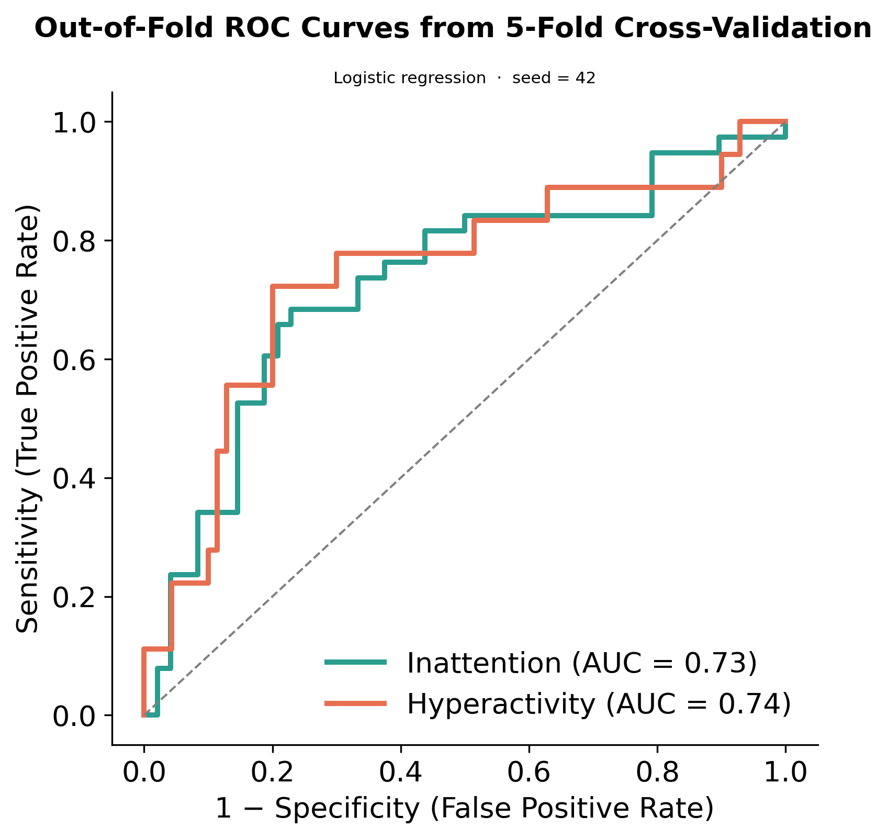

# ROC Curves / AUC

Category: Classic Machine Learning

وقتی مدل classification داریم، مدل واقعاً میاد از ویژگی‌ها یک تابع ریاضی یاد می‌گیره. بعد برای هر سابجکت یک score می‌دهد. این score معمولاً تبدیل می‌شود به probability که «این فرد چقدر شبیه کلاس ADHD است». مثلاً: 0.40

یعنی مدل فکر می‌کند این فرد 40٪ احتمال دارد ADHD باشد.

ولی هنوز تصمیم نهایی گرفته نشده. چون برای تصمیم نهایی باید threshold داشته باشیم.

مثلاً:

- اگر بالاتر از 0.5 بود → ADHD
- اگر پایین‌تر بود → non-ADHD

پس کاملاً درست گفتی که: مدل اول probability می‌دهد، و بعد threshold تعیین می‌کند وارد کدام دسته شود. بعد دقیقاً نکته مهم همین است که:

«threshold خودش مسئله است.

اگر threshold را خیلی سخت بگیری: مثلاً 0.9 فقط آدم‌هایی که مدل خیلی مطمئن است positive می‌شوند.

در نتیجه:

- false positive کم می‌شود
- true positive هم کم می‌شود

یعنی: ADHD های واقعی زیادی را از دست می‌دهی

برعکس، اگر threshold را خیلی پایین بیاوری: مثلاً 0.1 تقریباً همه positive می‌شوند. در نتیجه:

- true positive زیاد می‌شود
- false positive هم خیلی زیاد می‌شود

یعنی کلی آدم سالم را اشتباهی ADHD اعلام می‌کنی.

پس ROC دقیقاً دارد این trade-off را نشان می‌دهد.

وقتی مدل هیچ signal یاد نگرفته باشد، score هایی که می‌دهد دیگر واقعاً بین ADHD و non-ADHD تفاوتی ندارند. یعنی distribution دو گروه تقریباً یکی می‌شود.

در نتیجه:

هر threshold که انتخاب کنی، true positive rate و false positive rate تقریباً با هم بالا و پایین می‌روند.

برای همین ROC تبدیل می‌شود به همان خط مورب خاکستری.

یعنی: TPR ≈ FPR

مثلاً:

- اگر 20٪ آدم‌های سالم را positive کردی، تقریباً 20٪ ADHD ها را هم positive می‌کنی.
- اگر 70٪ سالم‌ها positive شدند، تقریباً 70٪ ADHD ها هم positive می‌شوند.

یعنی مدل هیچ قدرت جداکنندگی ندارد. برای همین خط random دقیقاً قطر نمودار می‌شود.

و هرچقدر ROC بالاتر از آن خط باشد، یعنی مدل بهتر توانسته دو گروه را از هم جدا کند.

## ROC Curve Explanation

آیا مدل با تغییر threshold به شکل معنادار و قابل انتظار رفتار می‌کند، یا فقط تصادفی در حال دسته‌بندی است؟

ROC Curve Explanation

این گراف نشان می‌دهد اگر threshold را عوض کنیم، مدل چقدر خوب می‌تواند بین ADHD و non-ADHD تفاوت بگذارد. مدل به هر کودک یک score می‌دهد. مثلاً ممکن است برای یک کودک عدد 0.91 بدهد و برای کودک دیگر 0.22. این عدد یعنی مدل فکر می‌کند آن کودک چقدر شبیه گروه ADHD است.

اما هنوز تصمیم نهایی گرفته نشده، چون برای تصمیم نهایی باید threshold تعیین کنیم. مثلاً اگر threshold برابر 0.5 باشد، هر کسی که score بالاتر از 0.5 داشته باشد وارد گروه ADHD می‌شود. ولی اگر threshold را 0.8 بگذاریم، مدل سخت‌گیرتر می‌شود و فقط کسانی که score خیلی بالایی دارند positive می‌شوند.

پس با تغییر threshold رفتار مدل تغییر می‌کند. گاهی ADHD های بیشتری پیدا می‌شوند، ولی همزمان false positive هم بیشتر می‌شود. گاهی هم برعکس، false positive کم می‌شود ولی ADHD های واقعی از دست می‌روند.

این ROC curve دقیقاً رفتار مدل را در threshold های مختلف نشان می‌دهد. برای هر threshold دو عدد حساب می‌شود:

- True Positive Rate: چند ADHD واقعی درست پیدا شدند
- False Positive Rate: چند آدم سالم اشتباهی ADHD تشخیص داده شدند

در نمودار تو محور افقی False Positive Rate است و محور عمودی True Positive Rate.

مثلاً اگر روی منحنی نقطه‌ای داشته باشیم که x=0.20 و y=0.76 باشد، یعنی مدل توانسته 76٪ ADHD های واقعی را پیدا کند، در حالی که فقط 20٪ بچه‌های سالم را اشتباهی positive کرده است. این معمولاً نقطه نسبتاً خوبی است، چون sensitivity بالاست ولی false alarm هنوز خیلی زیاد نشده.

اما اگر نقطه‌ای داشته باشیم که x=0.80 و y=0.90 باشد، یعنی مدل 90٪ ADHD ها را پیدا کرده، ولی 80٪ آدم‌های سالم را هم اشتباهی ADHD گفته است. یعنی مدل تقریباً به همه هشدار می‌دهد. پس ROC در واقع دارد trade-off بین پیدا کردن ADHD های واقعی و اشتباه هشدار دادن را نشان می‌دهد.

خط خاکستری مورب یعنی مدل کاملاً random عمل می‌کند و هیچ signal واقعی یاد نگرفته. در این حالت True Positive Rate تقریباً با False Positive Rate برابر می‌شود. مثلاً اگر 30٪ آدم‌های سالم positive شوند، تقریباً 30٪ ADHD ها هم positive می‌شوند. اگر 70٪ سالم‌ها positive شوند، تقریباً 70٪ ADHD ها هم positive می‌شوند. یعنی مدل هیچ قدرت جداکنندگی ندارد.

اما منحنی‌های مدل تو بالاتر از خط random قرار گرفته‌اند. این یعنی مدل واقعاً الگوهایی در داده پیدا کرده و فقط شانسی عمل نمی‌کند.

حالا AUC چیست؟

AUC یعنی: Area Under the Curve

یعنی مساحت زیر ROC curve.

به جای اینکه فقط به یک نقطه از نمودار نگاه کنیم، AUC کل کیفیت منحنی را در همه threshold ها خلاصه می‌کند.

اگر:

- AUC = 0.50 → مدل شانسی است
- AUC = 1.00 → مدل کامل است

در شکل تو:

- Inattention → AUC = 0.73
- Hyperactivity → AUC = 0.74

این یعنی اگر: یک کودک ADHD و یک کودک non-ADHD را تصادفی انتخاب کنیم، مدل حدود 73 تا 74 درصد مواقع به کودک ADHD score بالاتری می‌دهد.

پس AUC در واقع اندازه می‌گیرد مدل در کل چقدر خوب می‌تواند دو گروه را از هم جدا کند.