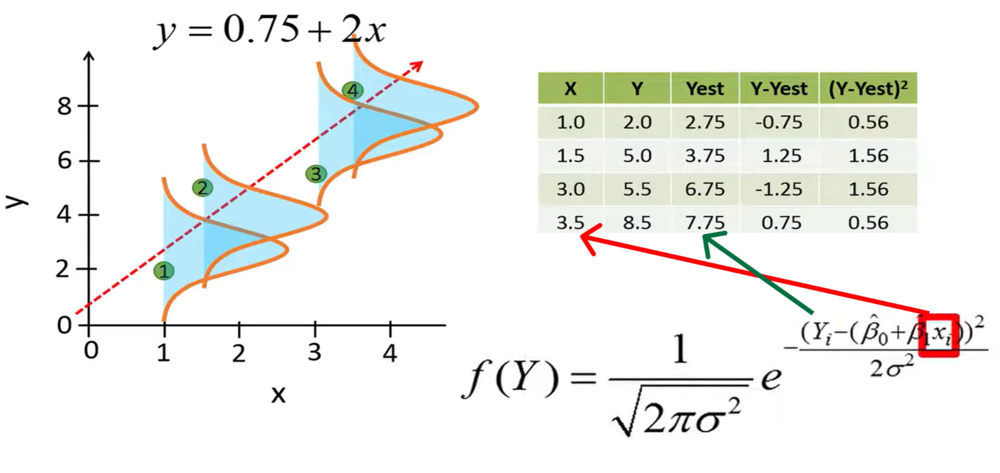
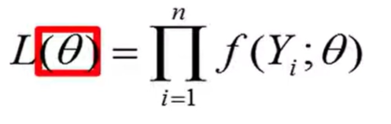
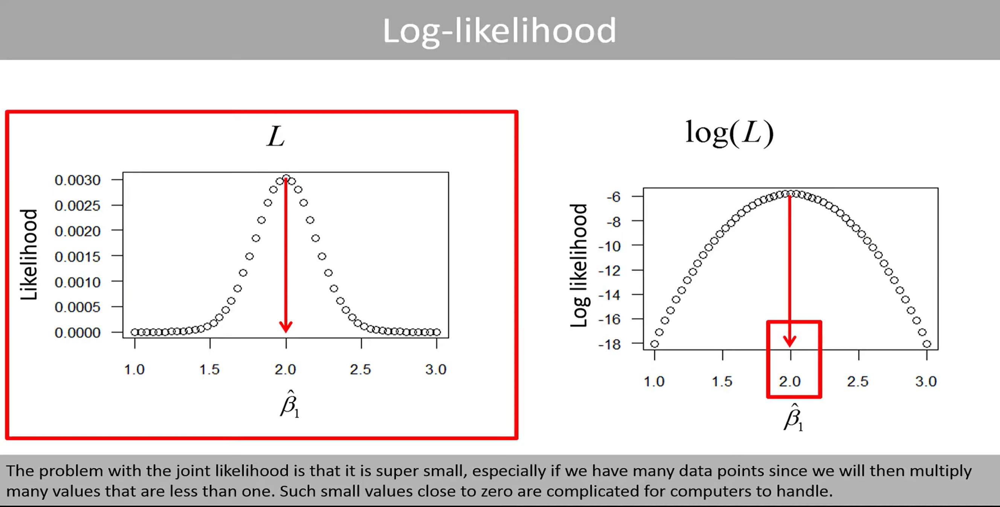

# Regression Estimation Methods

Category: Classic Machine Learning
Sub Category: Supervised

[**Linear** Regression ](Linear%20Regression%2034afda699d5680c78f9cf7192fa1b762.md)

[Multiple Regression](Multiple%20Regression%20351fda699d56809a9781fd12c5200acf.md) 

# Regression Estimation Methods (how to choose the best line) (OLS, ULS, OLS، ULS، WLS, Ridge و Lasso

اینا همشون یه کار می‌کنن:

**می‌خوان یه خط/مدل پیدا کنن که بهترین فیت رو به داده بده**

فقط فرقشون اینه که تعریفشون از "بهترین" فرق می‌کنه.

## Least Squares methods: مثل OLS، ULS، WLS

 «بیایم خطایی که داریم رو اندازه بگیریم، بعد کاری کنیم که این خطا کمترین بشه»

خطا هم همون residual ـه: 

$$
y_{i} - \hat{y_{i}}
$$

و معمولاً مربعش رو جمع می‌کنن.

### OLS (ordinary least square)

همینی که گفتیم! میاد sum of square of residual رو حساب میکنیم!

$$
\sum({y_{i} - \hat{y_{i}})^2 }
$$

### WLS (weighted least squares)

$$
\sum w_{i}({y_{i} - \hat{y_{i}})^2 }
$$

### ULS (unweighted least squares)

$$
\sum w_{i}({y_{i} - \hat{y_{i}})^2 }
$$

## Likelihood-based methods: مثل ML, MAP

### Maximum Likelihood (ML)

تو این روش میخواد یه خط توزیع رو داده های ما برازش کنه! مثلا اگر بخواد یه توزیع نرمال رو به داده های ما برازش کنه میاد کلی توزیع های مختلف با میانگین های مختلف و variance مختلف (لاغر معمولی چاق) رو فیت میکنه ببینه کجا بیشترین احتمال وجود داره که داده ی ما بیشتر اونجا باشه. 

حالا فرقش با least square در رگرسیون خطی چیه؟

توی این روش به میاد میانگین رو خط در نظر میگیری و در هر نقطه داده که داریم یک توزیع درست میکنه (به عنوان مثال نرمال اینجا)

توی فرمول توزیع نرمال میتونیم میانگین رو بذاریم فرمول خط (چون قرار شد برای هر نقطه یک توزیع درست کنیم که میانگینش y  روی خطه) بعد میاد پیدا میکنه کدوم خطه که باعث میشه که این likelihood زیاد بشه

حالا نکته جالب اینه که توی ols فرض بر اینه که توزیع نرماله! ولی برای این میشه از هر  توزیعی استفاده کرد!

### **Maximum A Posteriori (MAP)**

## Regularized methods: مثل Ridge و Lasso

### Ridge regression

وقتی ما میایم یه خط رو فیت دیتای train میکنیم اون خط ممکنه overfit بشه  پس اینجا به جای اینکه بیاد خطی که بهترین فیت رو میده رو پیدا کنه میاد یه مقدار bias  بهش اضافه میکنه! و اگر ما لامبدا رو خیلی بزرگ بگیریم خط نهایی شبیه به خط افقی میشه و در اصل انگار که وزن ها دیگه مهم نیستن
حالا چجوری میشه فهمید که کدوم لامبدا ؟ میایم یه عالمه لامبدا رو امتحان میکنیم با cross validation

ridge regression can work for classification also!!!!!

## Lasso