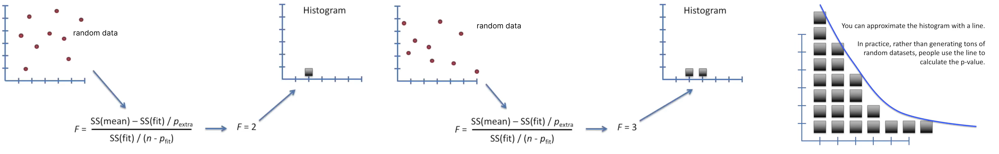
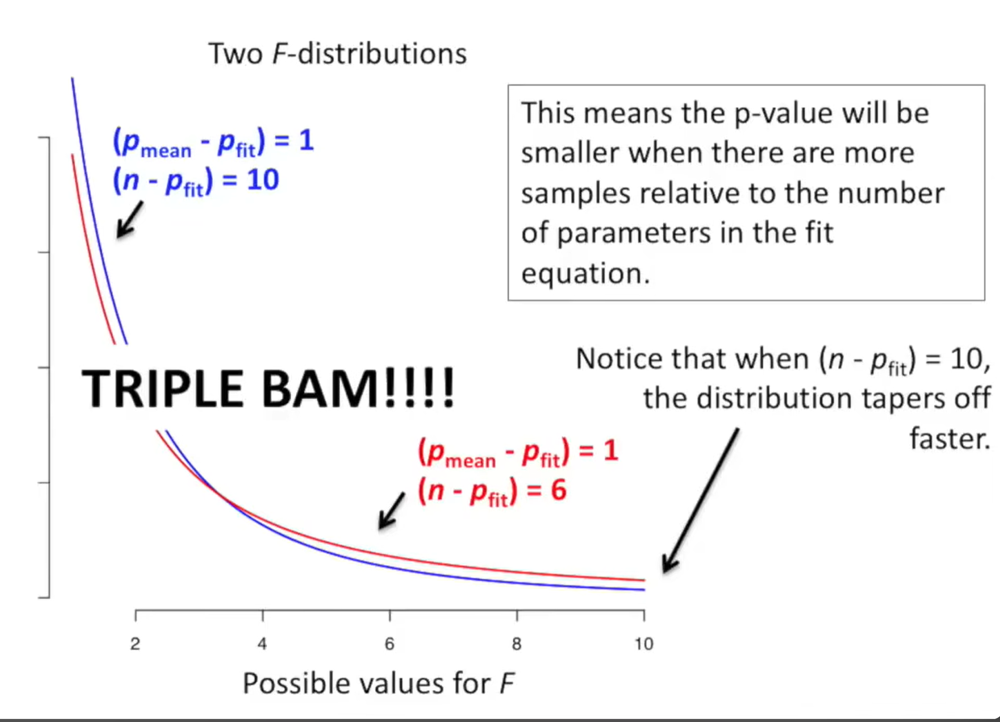

# p-Values

Category: Foundations (Statistics and Math)
Status: Todo

# P-value

برای محاسبه ی p-value یه عالمه عدد رندوم درست میکنیم و حساب میکنیم براش F حساب میکنیم و این کار رو شاید میلیون ها بار انجام میدیم و میذاریمشون توی histogram. 

بعد اومدن این کار رو بار های بار با درجه های ازادی متفاوت انجام دادن ویه سری جدول ها ساختن که ما با توجه به درجه ازادی و F میتونیم بریم p-value رو حساب کنیم!

